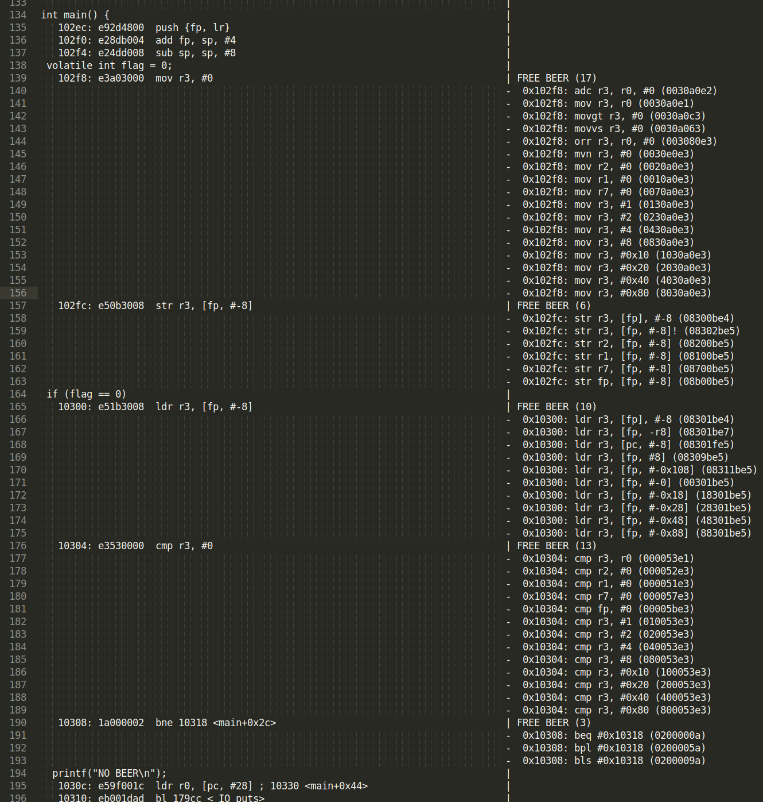

# qiling-fi

Using qiling to build simple scripts simulating fault models.

Tested in Ubuntu 18.04 and WSL Ubuntu 18.04

# Set up qiling

https://docs.qiling.io/en/latest/install/

```
python3 -m venv venv-wsl
. venv\bin\activate
python -m pip install qiling --pre
python -m pip install tqdm
```

# Set up arm compiler

```
apt install gcc-8-arm-linux-gnueabi
```

# Compile ifelse.c

```
arm-linux-gnueabi-gcc-8 -static -g ifelse.c -o ifelse
```

Create inline assembly dump:

```
arm-linux-gnueabi-objdump -S ifelse > ifelse.objdump
```

`ifelse.objdump` can be used to very conveniently find addresses etc.

# Run focused random

```
python3 ifelse_focused_random.py
```

One hook:

```
ql.hook_code(print_asm)
```
Uses capstone to decompile portions of the binary, useful for tracing

Patch `fi_addr` with `fi_random_bytes`.

Each run uses `patch` to fill a random address of the `main` block of `ifelse` with random bytes. Data is collected in `ifelse.sqlite`. 

While executing counters are printed:
```
[11038] FREE_BEER: 286 | NO_BEER: 1465 | EXCEPTION: 3845
```

Database contains bit more info:


# SQL queries and results with random bytes

FREE BEER counts with random bytes at the compare instruction:
```
SELECT data,count(id),1.0*count(id)/(sum(count(*)) over()) AS frac FROM log_1596811491505 GROUP BY data
```
|  Output                  | Count |  Frac                 |
|--------------------------|-------|-----------------------|
|                          | 8763  | 0.605137766728817     |
|\x01                      | 1     | 6.90560044195843e-05  |
|FREE BEER                 | 187   | 0.0129134728264623    |
|FREE BEER\x0a             | 180   | 0.0124300807955252    |
|\x4c\xcf\xf3\x7f          | 1     | 6.90560044195843e-05  |
|NO BEER                   | 3433  | 0.237069263172433     |
|NO BEER\x0a               | 1786  | 0.123334023893378     |
|NO BEER\x0aFREE BEER\x0a  | 130   | 0.00897728057454596   |

Exception counts:
```
SELECT exception,count(id),1.0*count(id)/(sum(count(*)) over()) AS frac FROM log_1596811491505 GROUP BY exception
```
|  Exception                                          |  Count |  Frac                 |
|-----------------------------------------------------|--------|-----------------------|
| 	                                                  |  11261 | 0.657730272764441     |
| Invalid instruction (UC_ERR_INSN_INVALID)           |  1821  | 0.106360609777466     |
| Invalid memory read (UC_ERR_READ_UNMAPPED)          |  2723  | 0.159044448338298     |
| Invalid memory write (UC_ERR_WRITE_UNMAPPED)        |  1034  | 0.0603936685941242    |
| Write to write-protected memory (UC_ERR_WRITE_PROT) |  281   | 0.0164125927223877    |
| _hook_intr_cb : catched == False                    |  1     | 5.84078032825185e-05  |


# Single bit flip and single nop

```
python3 ifelse_singlebit_sequential.py
python3 ifelse_nop_sequential.py
```

# Annotated objdump

Script to parse sqlite db and add notes to the objdump (set the right TABLE_NAME manually):
```
python annotate_objdump.py
```

Example outputs added to repo, see also screenshot below:

